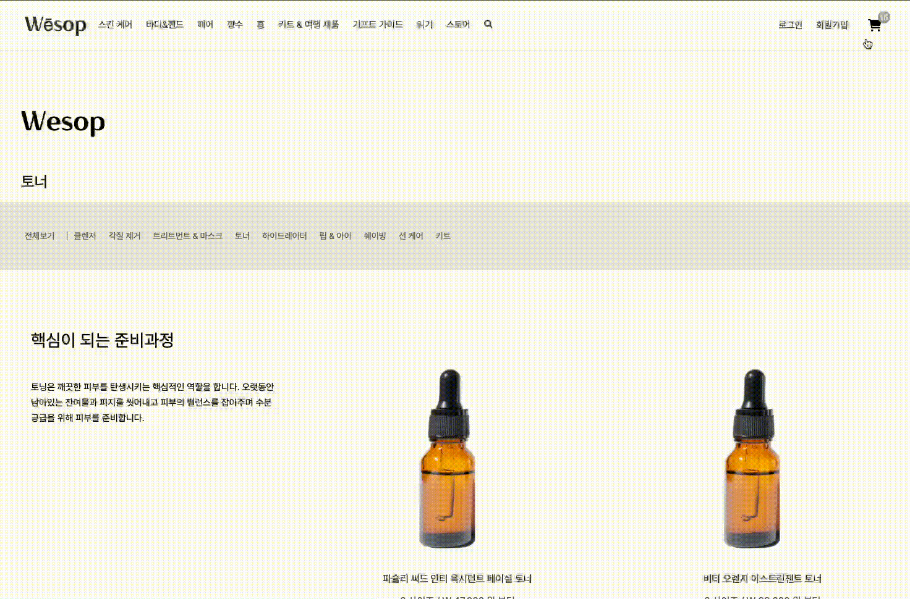

# Wesop Client Project

## 🌟 Wesop Project Front Family

- F.E 
  [서한샘](https://github.com/kor-sams-dev)
  [박수연](https://github.com/dduddu92)
  [홍희윤](https://github.com/namu2267/)
  [조예지](https://github.com/Dumibell)

 

## 🌟 What is Wesop Client Project?

- 기존의 Aesop 사이트를 클론 코딩하여 React Page로 변환해가며 React를 학습하는 것을 목표로 두고 있음.
- 외부 라이브러리를 최대한 활용하지 않고 기초 문법과 기초 태그만을 활용하여 기능을 구현함

 

## 🌟개발 인원 및 기간

- 개발기간 2022/06/20 ~ 2022/07/01
- 개발 인원 프론트엔드 4명, 백엔드 1명

 

## 🌟 적용 기술 및 구현 기능

### 적용 기술

 

## 🌟 구현 페이지

 

### 메인 화면

## 

-

### 제품 리스트 화면

## 

-

### 상세 제품조회 화면

## 

## 

-

### 회원정보 관리 화면

## 

-

### 회원가입

## 

-

### 로그인

## 

-

### 네비게이션

## 

-

### 장바구니

## 

-
